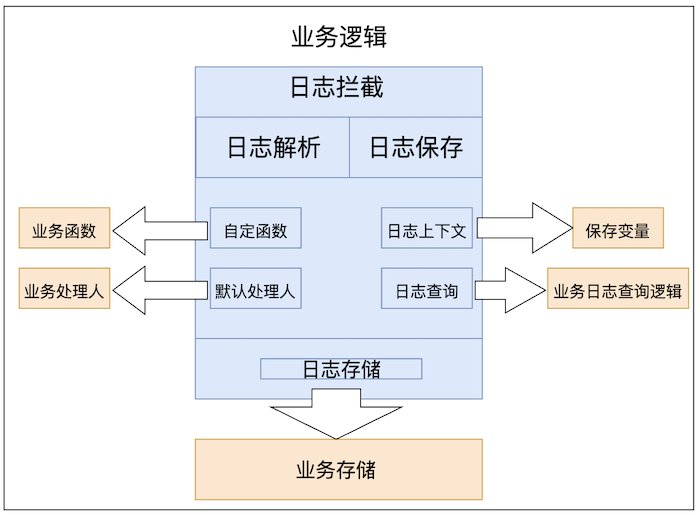
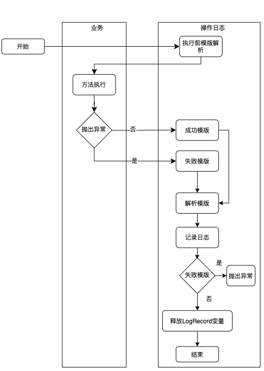
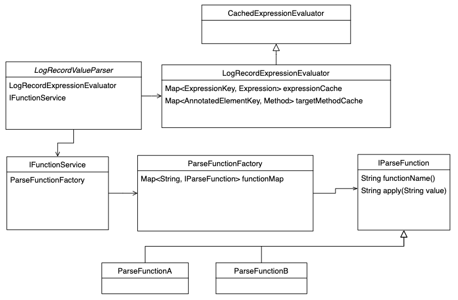

### 前言
本项目参考[美团操作日志方案思路](https://tech.meituan.com/2021/09/16/operational-logbook.html)进行实现

使用用法可以参考[通用日志组件使用方法](https://blog.csdn.net/hu_zhiting/article/details/127881028?spm=1001.2014.3001.5501)

### 代码结构

##### 当前业务拦截的流程

##### 当前starter包解析的类图如下所示

